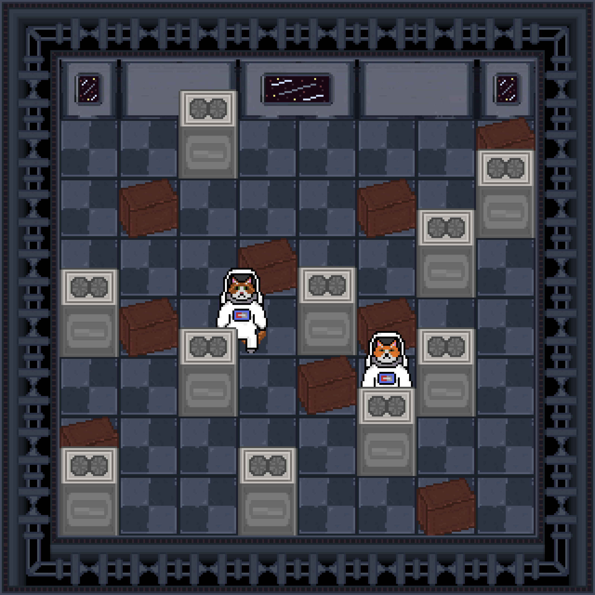

# CtrlAltDefeat

## A játék leírása

A játék egy kétdimenziós pályán játszódik, amely négyzet alakú mezőkből áll. A játékot három játékos játssza,
akiknek 1-1 Bombercat figurát irányítva céljuk, hogy egyedüliként maradjanak életben.
A játékpálya mezőin falelemek, dobozok, szörnyek és maguk a játékosok figurái helyezkednek el.
A játékosok bombákat lehelyezve felrobbanthatják a dobozokat, szörnyeket és a játékosokat (akár saját magukat is).
Egy játékos veszt (és ezáltal ellenfele győz), ha felrobban, vagy ha egy szörny elkapja.

## Mire is van lehetőség egy körben?

 -**Játékos Mozgatása:**
Minden játékosnak lehetősége van mozogni a játéktéren belül, hogy elkerülje a bombákat és más játékosokat,
 illetve hogy bónuszokat gyűjtsön be.

-**Bombák Lerakása:**
A játékosok bombákat helyezhetnek el a játéktér különböző pontjain. Ezek a bombák robbanáskor kárt okoznak a 
környezetükben, például felrobbanthatnak falakat, megölhetnek más játékosokat vagy szörnyeket.

-**Bónuszok Felvétele:**
A játékosok különféle bónuszokat gyűjthetnek be a játékmezőn, amelyek különféle előnyöket biztosítanak számukra.
Például sebességnövelő bónuszok, nagyobb robbanási sugárzóna vagy extra bombák.

-**Ellenségek Elpusztítása:**
A játékosoknek lehetőségük van bombákkal vagy más módon elpusztítani a játékban szereplő szörnyeket vagy
más játékosokat. Ez pontokat vagy más előnyöket szerezhet nekik a játék során.

-**Támadások Elkerülése:**
A játékosoknak figyelniük kell a körülöttük zajló eseményekre, és meg kell próbálniuk elkerülni a más játékosok
által lerakott bombákat és támadásokat.

-**Taktikai Döntések:**
A játékosoknak taktikusan kell gondolkodniuk a játék során, például meg kell határozniuk, hogy mikor és hova
helyezzenek bombákat, vagy mikor és hogyan használják fel a bónuszokat a legnagyobb hatékonyság érdekében.

## Hogyan is néz ki a Multiplayer Bomberman?

### Main menu

### Gameplay
-**Jelenleg:**

-**Terv:**

## Játék futtatás
A játék futtatásához Java SE 21-es verzióra van szükségünk. Ezen felül még egy környezeti változóra, amit "game_path"-nek hívnak. Ennek a környezeti változónak a zip fájlból kitömörített assets mappára kell mutatnia. 
