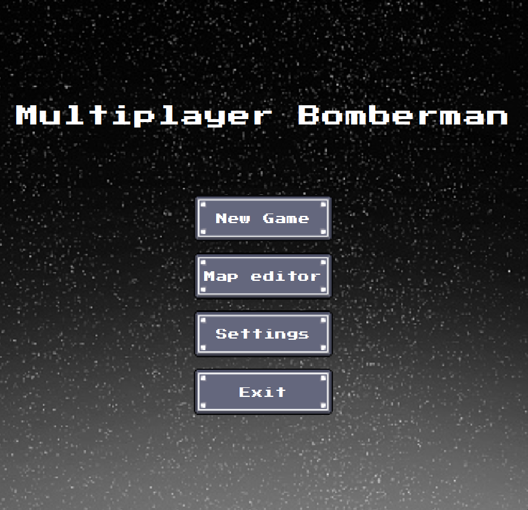
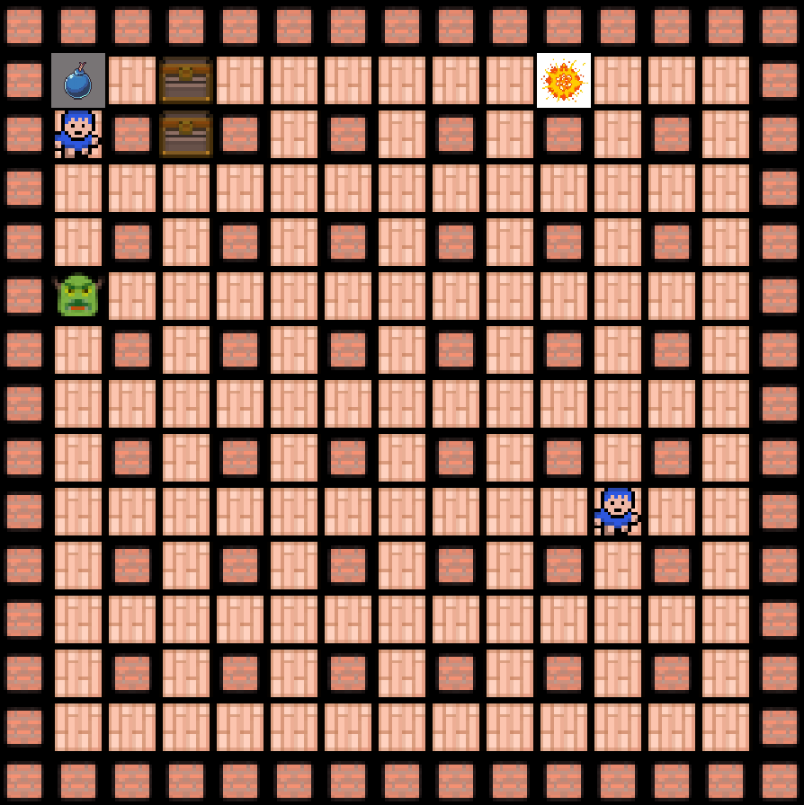
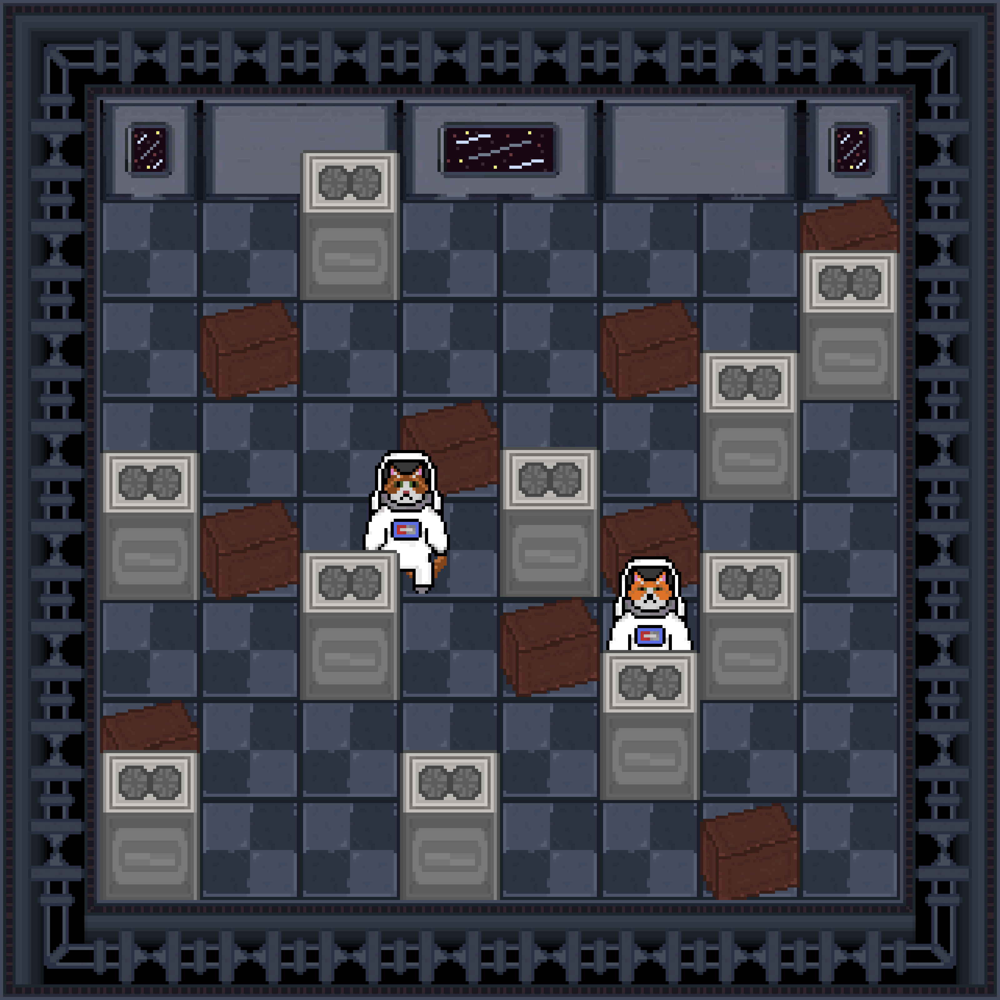

# CtrlAltDefeat

## A játék leírása

A játék egy 2 dimenziós pályán játszódik, amely négyzet alakú mezőkből áll. A játékot 2 játékos játssza, akiknek 1-1 bomberman figurát irányítva céljuk, hogy egyedüliként maradjanak életben. A játékpálya mezőin fal elemek, dobozok, szörnyek és maguk a játékosok figurái helyezkednek el. A játékosok bombákat lehelyezve felrobbanthatják a dobozokat, szörnyeket és a játékosokat (akár saját magukat is). Egy játékos veszt (és ezáltal ellenfele győz), ha felrobban, vagy ha egy szörny elkapja.

## Mire is van lehetőség egy körben?

 -**Játékos Mozgatása:**
Minden játékosnak lehetősége van mozogni a játéktéren belül, hogy elkerülje a bombákat és más játékosokat, illetve gyűjtsön be bónuszokat és tárgyakat.

-**Bombák Lerakása:**
A játékosok bombákat helyezhetnek el a játéktéren különböző pontokon. Ezek a bombák robbanáskor kárt okoznak a környezetükben, például felrobbanthatnak falakat, megölhetik más játékosokat vagy szörnyeket.

-**Bónuszok Felvétele:**
A játékosok különféle bónuszokat gyűjthetnek be a játékmezőn, amelyek különféle előnyöket biztosítanak számukra. Például sebességnövelő bónuszok, nagyobb robbanási sugárzóna vagy extra bombák.

-**Ellenségek Elpusztítása:**
A játékosoknek lehetőségük van bombákkal vagy más módon elpusztítani a játékban szereplő szörnyeket vagy más játékosokat. Ez pontokat vagy más előnyöket szerezhet nekik a játék során.

-**Támadások Elkerülése:**
A játékosoknak figyelniük kell a körülöttük zajló eseményeket, és megpróbálniuk elkerülni a más játékosok által lerakott bombákat és támadásokat.

-**Taktikai Döntések:**
A játékosoknak taktikailag kell gondolkodniuk a játék során, például meg kell határozniuk, hogy mikor és hova helyezzenek bombákat, vagy mikor és hogyan használják fel a bónuszokat a legnagyobb hatékonyság érdekében.

## Hogyan is néz ki a Multiplayer Bomberman?

### Main menu

### Gameplay
-**Jelenleg:**

-**Terv:**

